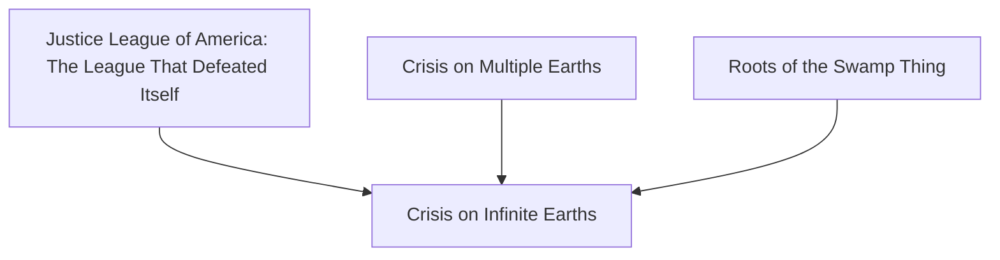
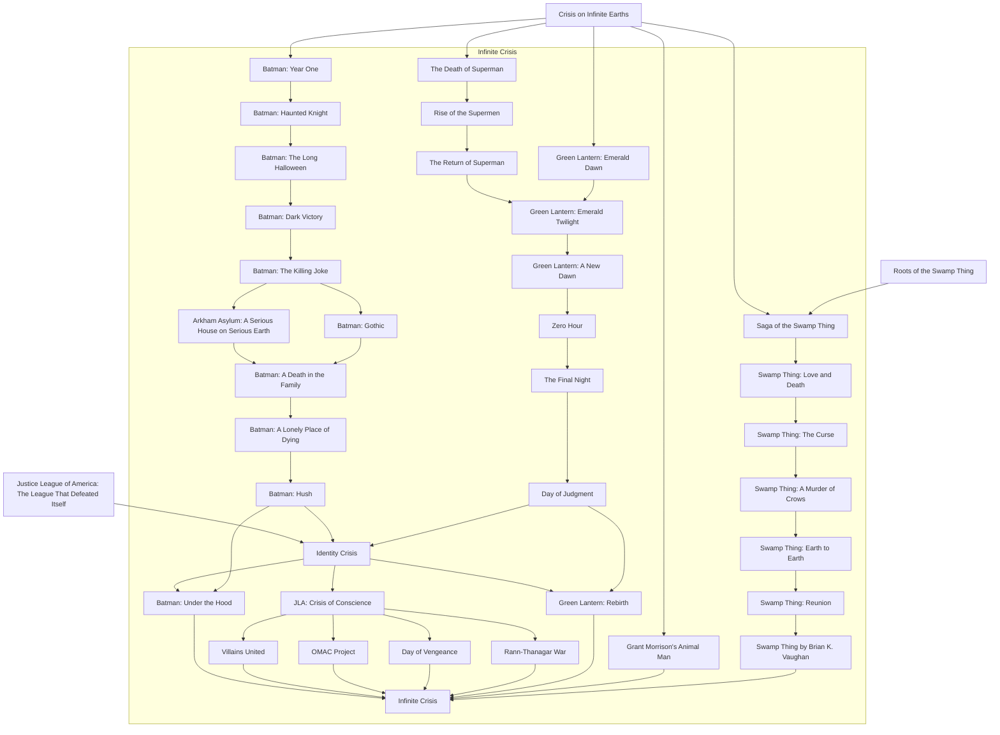
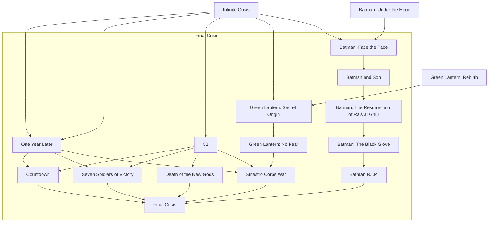
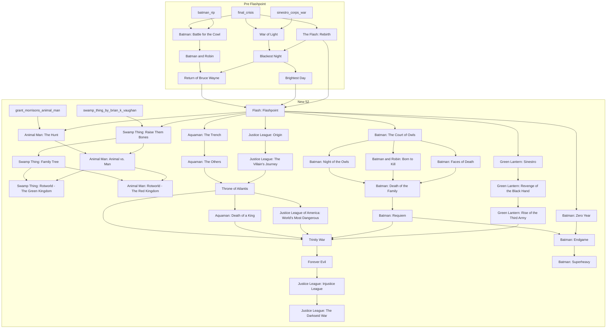

# DC Reading Order with GitLab CI/CD

[](https://gitlab.com/r8vnhill/dc-reading-order/-/pipelines)
[](https://github.com/r8vnhill/dc-reading-order)
[](https://gitlab.com/r8vnhill/dc-reading-order)

This project uses GitLab CI/CD as a visual tracker for reading DC comic arcs.

Each arc is represented by a pipeline job, and reading-order arrows are modeled with `needs`.

> **ℹ️ Note:** The CI/CD pipeline functionality is only available on GitLab. The GitHub repository is a mirror for visibility and collaboration.

----

## Table of Contents

- [DC Reading Order with GitLab CI/CD](#dc-reading-order-with-gitlab-cicd)
  - [Table of Contents](#table-of-contents)
  - [Personal context](#personal-context)
  - [Core idea](#core-idea)
  - [Quick Start](#quick-start)
  - [Mermaid graph](#mermaid-graph)
    - [Crisis on Infinite Earths](#crisis-on-infinite-earths)
    - [Infinite Crisis](#infinite-crisis)
  - [Final Crisis](#final-crisis)
  - [Local GitLab Runner setup (`local` tag)](#local-gitlab-runner-setup-local-tag)
  - [How to mark arcs as read](#how-to-mark-arcs-as-read)
  - [Quick example](#quick-example)
  - [Recommended workflow](#recommended-workflow)
  - [Reading variables](#reading-variables)
  - [Additional Information](#additional-information)
    - [What's included in this reading order?](#whats-included-in-this-reading-order)
      - [Batman](#batman)
      - [Superman](#superman)
      - [Green Lantern](#green-lantern)
      - [Swamp Thing \& Animal Man](#swamp-thing--animal-man)
      - [Justice League \& Aquaman](#justice-league--aquaman)
      - [Major Events (convergence points)](#major-events-convergence-points)
    - [Key convergence points](#key-convergence-points)

----

## Personal context

This is my personal DC Comics mainline recommendation, so it is intentionally opinionated.
You will notice a lot of Batman and Green Lantern (yes, that is very much on purpose).

My suggestion is to start at one of the major crossovers depending on how many years you want to spend reading:

- Longer commitment: start after `Crisis on Infinite Earths` (or from the beginning if you want the full ride)
- Medium commitment: start after `Infinite Crisis`
- Shorter commitment: start after `Flashpoint`

----

## Core idea

- By default, **all jobs fail**.
- A job only passes if its `READ_*` variable is set to `1`.
- Jobs also depend on previous arcs, so you cannot progress without completing prerequisites.
- All jobs are tagged with `local`, so they run on a runner with that tag.

>[!TIP] Why a local runner?
> Using a local GitLab Runner means you won't waste your CI/CD quota on silly reading trackers, plus it's a great exercise to learn how runners work c:

----

## Quick Start

1. **Fork or clone the repository** (on GitLab for full pipeline functionality)
2. **Set up a local GitLab Runner** with the `local` tag (see [setup instructions](#local-gitlab-runner-setup-local-tag))
3. **Choose your starting point**:
   - New to DC? Start from the beginning (Crisis on Multiple Earths)
   - Want the modern era? Start after Flashpoint
   - Want something in between? Start after Crisis on Infinite Earths or Infinite Crisis
4. **Run your first pipeline** on GitLab without any variables to see all jobs fail
5. **As you read each arc**, rerun the pipeline with the corresponding `READ_*` variable set to `1`
6. **Watch your progress** through the visual pipeline graph as jobs turn green!

**Example**: After reading your first arc, go to **Build > Pipelines > Run pipeline** and add:
```
READ_CRISIS_ON_MULTIPLE_EARTHS=1
```

>[!NOTE] About Crisis on Multiple Earths Collections
> If you're reading the *Crisis on Multiple Earths* thematic collections (Crossing Over, Crisis Crossed, Countdown to Crisis), note that *Justice League of America: The League That Defeated Itself* is relatively contemporary to *Countdown to Crisis*. However, *Crisis on Multiple Earths* is **not required** as a prerequisite for JLA.

----

## Mermaid graph

>[!TIP]
> For better visualization of the flowcharts below, copy the mermaid code and paste it into [mermaid.live](https://mermaid.live) for an interactive view with zoom and pan capabilities.

### Crisis on Infinite Earths



### Infinite Crisis



## Final Crisis

>[!NOTE]
> Recommended reading order tweak: read **Green Lantern: Secret Origin** immediately after **Infinite Crisis**.
> Even though *Secret Origin* was published later, it became Hal Jordan's new canonical origin after *Infinite Crisis*.





----

## Local GitLab Runner setup (`local` tag)

1. Install GitLab Runner on your machine.
2. In GitLab, go to **Settings > CI/CD > Runners** and copy a runner registration token.
3. Register the runner: `gitlab-runner register`
4. Use these values during registration:
   - GitLab instance URL: your GitLab URL (for example `https://gitlab.com`)
   - Token: the registration token from your project/group
   - Description: any name (for example `local-runner`)
   - Tags: `local`
   - Run untagged jobs: `false`
   - Lock to current project: `true` (recommended)
   - Executor: `shell` (or your preferred local executor)
5. Start the runner service: `gitlab-runner run`

If your runner is already installed as a service, ensure it is running and has the `local` tag.

----

## How to mark arcs as read

Prerequisite: a GitLab Runner with tag `local` must be online, otherwise jobs stay pending.

1. Go to **GitLab > Build > Pipelines > Run pipeline**.
2. In Variables, add `READ_...=1` for each arc you already read.
3. Run the pipeline.
4. Only jobs enabled by both variables and dependencies will pass.

----

## Quick example

If you already read the first three arcs:

- `READ_CRISIS_ON_MULTIPLE_EARTHS=1`
- `READ_JUSTICE_LEAGUE_OF_AMERICA_LEAGUE_THAT_DEFEATED_ITSELF=1`
- `READ_CRISIS_ON_INFINITE_EARTHS=1`

When you run the pipeline:

- `crisis_on_multiple_earths` passes.
- `crisis_on_infinite_earths` passes.
- Next jobs fail (or stay blocked) until you add their variables.

----

## Recommended workflow

1. Start with a pipeline run without variables to see the full pending/failing state.
2. Every time you finish an arc, add its `READ_*` variable in the next run.
3. Repeat until you complete the full path.

----

## Reading variables

These are the variables used by the pipeline. Set each one to `=1` to approve an arc:

- `READ_CRISIS_ON_MULTIPLE_EARTHS`
- `READ_ROOTS_OF_THE_SWAMP_THING`
- `READ_JUSTICE_LEAGUE_OF_AMERICA_LEAGUE_THAT_DEFEATED_ITSELF`
- `READ_CRISIS_ON_INFINITE_EARTHS`
- `READ_SAGA_OF_THE_SWAMP_THING`
- `READ_SWAMP_THING_LOVE_AND_DEATH`
- `READ_SWAMP_THING_THE_CURSE`
- `READ_SWAMP_THING_A_MURDER_OF_CROWS`
- `READ_SWAMP_THING_EARTH_TO_EARTH`
- `READ_SWAMP_THING_REUNION`
- `READ_BATMAN_YEAR_ONE`
- `READ_THE_DEATH_OF_SUPERMAN`
- `READ_GREEN_LANTERN_EMERALD_DAWN`
- `READ_BATMAN_HAUNTED_KNIGHT`
- `READ_RISE_OF_THE_SUPERMEN`
- `READ_BATMAN_THE_LONG_HALLOWEEN`
- `READ_THE_RETURN_OF_SUPERMAN`
- `READ_BATMAN_DARK_VICTORY`
- `READ_GREEN_LANTERN_EMERALD_TWILIGHT`
- `READ_BATMAN_THE_KILLING_JOKE`
- `READ_GREEN_LANTERN_A_NEW_DAWN`
- `READ_BATMAN_A_DEATH_IN_THE_FAMILY`
- `READ_ARKHAM_ASYLUM_SERIOUS_HOUSE`
- `READ_BATMAN_GOTHIC`
- `READ_BATMAN_A_LONELY_PLACE_OF_DYING`
- `READ_BATMAN_HUSH`
- `READ_ZERO_HOUR`
- `READ_THE_FINAL_NIGHT`
- `READ_DAY_OF_JUDGMENT`
- `READ_IDENTITY_CRISIS`
- `READ_JLA_CRISIS_OF_CONSCIENCE`
- `READ_VILLAINS_UNITED`
- `READ_OMAC_PROJECT`
- `READ_DAY_OF_VENGEANCE`
- `READ_RANN_THANAGAR_WAR`
- `READ_GREEN_LANTERN_REBIRTH`
- `READ_BATMAN_UNDER_THE_HOOD`
- `READ_INFINITE_CRISIS`
- `READ_ONE_YEAR_LATER`
- `READ_52`
- `READ_GREEN_LANTERN_SECRET_ORIGIN`
- `READ_GREEN_LANTERN_NO_FEAR`
- `READ_BATMAN_FACE_THE_FACE`
- `READ_BATMAN_AND_SON`
- `READ_BATMAN_RESURRECTION_OF_RAS_AL_GHUL`
- `READ_BATMAN_THE_BLACK_GLOVE`
- `READ_BATMAN_RIP`
- `READ_COUNTDOWN`
- `READ_SEVEN_SOLDIERS_OF_VICTORY`
- `READ_DEATH_OF_THE_NEW_GODS`
- `READ_SINESTRO_CORPS_WAR`
- `READ_FINAL_CRISIS`
- `READ_FLASH_REBIRTH`
- `READ_BATMAN_AND_ROBIN`
- `READ_BATMAN_BATTLE_FOR_THE_COWL`
- `READ_BATMAN_RETURN_OF_BRUCE_WAYNE`
- `READ_WAR_OF_LIGHT`
- `READ_BLACKEST_NIGHT`
- `READ_BRIGHTEST_DAY`
- `READ_FLASH_FLASHPOINT`
- `READ_GRANT_MORRISONS_ANIMAL_MAN`
- `READ_ANIMAL_MAN_THE_HUNT`
- `READ_SWAMP_THING_BY_BRIAN_K_VAUGHAN`
- `READ_SWAMP_THING_RAISE_THEM_BONES`
- `READ_ANIMAL_MAN_ANIMAL_VS_MAN`
- `READ_SWAMP_THING_FAMILY_TREE`
- `READ_SWAMP_THING_ROTWORLD_GREEN_KINGDOM`
- `READ_ANIMAL_MAN_ROTWORLD_RED_KINGDOM`
- `READ_AQUAMAN_THE_TRENCH`
- `READ_AQUAMAN_THE_OTHERS`
- `READ_JUSTICE_LEAGUE_ORIGIN`
- `READ_JUSTICE_LEAGUE_VILLAINS_JOURNEY`
- `READ_THRONE_OF_ATLANTIS`
- `READ_AQUAMAN_DEATH_OF_A_KING`
- `READ_JUSTICE_LEAGUE_OF_AMERICA_WORLDS_MOST_DANGEROUS`
- `READ_TRINITY_WAR`
- `READ_FOREVER_EVIL`
- `READ_JUSTICE_LEAGUE_INJUSTICE_LEAGUE`
- `READ_JUSTICE_LEAGUE_DARKSEID_WAR`
- `READ_BATMAN_COURT_OF_OWLS`
- `READ_BATMAN_NIGHT_OF_THE_OWLS`
- `READ_BATMAN_DEATH_OF_THE_FAMILY`
- `READ_BATMAN_ZERO_YEAR`
- `READ_BATMAN_AND_ROBIN_BORN_TO_KILL`
- `READ_BATMAN_REQUIEM`
- `READ_BATMAN_FACES_OF_DEATH`
- `READ_BATMAN_ENDGAME`
- `READ_BATMAN_SUPERHEAVY`
- `READ_GREEN_LANTERN_SINESTRO`
- `READ_GREEN_LANTERN_REVENGE_OF_THE_BLACK_HAND`
- `READ_GREEN_LANTERN_RISE_OF_THE_THIRD_ARMY`

----

## Additional Information

### What's included in this reading order?

This pipeline extends beyond the core Crisis events with carefully selected story arcs organized by character/team:

#### Batman

- Early Post-Crisis: Year One, Haunted Knight, The Long Halloween, Dark Victory
- Classic: The Killing Joke, Arkham Asylum, Gothic, A Death in the Family, A Lonely Place of Dying
- Modern: Hush, Under the Hood, Face the Face, Batman and Son, Resurrection of Ra's al Ghul
- Morrison's run: The Black Glove, R.I.P., Battle for the Cowl, Batman and Robin, Return of Bruce Wayne
- New 52: Court of Owls, Night of the Owls, Death of the Family, Zero Year, Requiem, Endgame, Superheavy, Faces of Death

#### Superman
  
- Death and Return: The Death of Superman, Rise of the Supermen, The Return of Superman

#### Green Lantern

- Emerald Twilight: Emerald Dawn, The Return of Superman, Emerald Twilight, A New Dawn
- Geoff Johns' run: Rebirth, Secret Origin, No Fear, Sinestro Corps War, War of Light, Blackest Night, Brightest Day
- New 52: Sinestro, Revenge of the Black Hand, Rise of the Third Army

#### Swamp Thing & Animal Man

- Alan Moore era: Roots, Saga of the Swamp Thing, Love and Death, The Curse, A Murder of Crows, Earth to Earth, Reunion
- Morrison's Animal Man
- Modern: Swamp Thing by Brian K. Vaughan
- New 52: Raise Them Bones, The Hunt, Animal vs. Man, Family Tree, both Rotworld crossovers

#### Justice League & Aquaman

- New 52 Justice League: Origin, The Villain's Journey, World's Most Dangerous, Injustice League, Darkseid War
- Aquaman run: The Trench, The Others, Throne of Atlantis, Death of a King

#### Major Events (convergence points)

- Crisis on Multiple Earths → Crisis on Infinite Earths
- Zero Hour → The Final Night → Day of Judgment → Identity Crisis
- Countdown to Infinite Crisis — JLA: Crisis of Conscience, Villains United, OMAC Project, Day of Vengeance, Rann-Thanagar War
- Infinite Crisis → 52 & One Year Later → Seven Soldiers of Victory
- Death of the New Gods → Final Crisis
- The Flash: Rebirth → Flashpoint (reboot)
- Trinity War → Forever Evil

### Key convergence points

These are the major crossover events where multiple storylines merge:

1. **Crisis on Multiple Earths** - The beginning
2. **Crisis on Infinite Earths** - DC's first universe reboot
3. **Identity Crisis** - Dark turning point for DC heroes
4. **Infinite Crisis** - Aftermath of Identity Crisis
5. **Final Crisis** - Grant Morrison's New Gods epic
6. **Flash: Flashpoint** - New 52 reboot point
