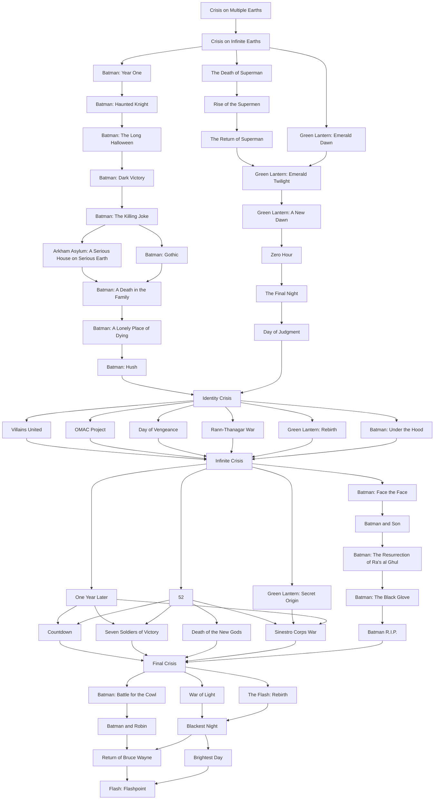

# DC Reading Order with GitLab CI/CD

This project uses GitLab CI/CD as a visual tracker for reading DC comic arcs.

Each arc is represented by a pipeline job, and reading-order arrows are modeled with `needs`.

----

## Table of Contents

- [DC Reading Order with GitLab CI/CD](#dc-reading-order-with-gitlab-cicd)
  - [Table of Contents](#table-of-contents)
  - [Personal context](#personal-context)
  - [Core idea](#core-idea)
  - [Local GitLab Runner setup (`local` tag)](#local-gitlab-runner-setup-local-tag)
  - [How to mark arcs as read](#how-to-mark-arcs-as-read)
  - [Quick example](#quick-example)
  - [Recommended workflow](#recommended-workflow)
  - [Reading variables](#reading-variables)
  - [Note](#note)
  - [Mermaid graph](#mermaid-graph)

----

## Personal context

This is my personal DC Comics mainline recommendation, so it is intentionally opinionated.
You will notice a lot of Batman and Green Lantern (yes, that is very much on purpose).

My suggestion is to start at one of the major crossovers depending on how many years you want to spend reading:

- Shorter commitment: start at `Identity Crisis`
- Medium commitment: start at `Infinite Crisis`
- Longer commitment: start at `Final Crisis` (or from the beginning if you want the full ride)

----

## Core idea

- By default, **all jobs fail**.
- A job only passes if its `READ_*` variable is set to `1`.
- Jobs also depend on previous arcs, so you cannot progress without completing prerequisites.
- All jobs are tagged with `local`, so they run on a runner with that tag.

----

## Local GitLab Runner setup (`local` tag)

1. Install GitLab Runner on your machine.
2. In GitLab, go to **Settings > CI/CD > Runners** and copy a runner registration token.
3. Register the runner:

```bash
gitlab-runner register
```

4. Use these values during registration:
- GitLab instance URL: your GitLab URL (for example `https://gitlab.com`)
- Token: the registration token from your project/group
- Description: any name (for example `local-runner`)
- Tags: `local`
- Run untagged jobs: `false`
- Lock to current project: `true` (recommended)
- Executor: `shell` (or your preferred local executor)

5. Start the runner service:

```bash
gitlab-runner run
```

If your runner is already installed as a service, ensure it is running and has the `local` tag.

----

## How to mark arcs as read

Prerequisite: a GitLab Runner with tag `local` must be online, otherwise jobs stay pending.

1. Go to **GitLab > Build > Pipelines > Run pipeline**.
2. In Variables, add `READ_...=1` for each arc you already read.
3. Run the pipeline.
4. Only jobs enabled by both variables and dependencies will pass.

----

## Quick example

If you already read the first two arcs:

- `READ_CRISIS_ON_MULTIPLE_EARTHS=1`
- `READ_CRISIS_ON_INFINITE_EARTHS=1`

When you run the pipeline:

- `crisis_on_multiple_earths` passes.
- `crisis_on_infinite_earths` passes.
- Next jobs fail (or stay blocked) until you add their variables.

----

## Recommended workflow

1. Start with a pipeline run without variables to see the full pending/failing state.
2. Every time you finish an arc, add its `READ_*` variable in the next run.
3. Repeat until you complete the full path.

----

## Reading variables

These are the variables used by the pipeline. Set each one to `=1` to approve an arc:

- `READ_CRISIS_ON_MULTIPLE_EARTHS`
- `READ_CRISIS_ON_INFINITE_EARTHS`
- `READ_BATMAN_YEAR_ONE`
- `READ_THE_DEATH_OF_SUPERMAN`
- `READ_GREEN_LANTERN_EMERALD_DAWN`
- `READ_BATMAN_HAUNTED_KNIGHT`
- `READ_RISE_OF_THE_SUPERMEN`
- `READ_BATMAN_THE_LONG_HALLOWEEN`
- `READ_THE_RETURN_OF_SUPERMAN`
- `READ_BATMAN_DARK_VICTORY`
- `READ_GREEN_LANTERN_EMERALD_TWILIGHT`
- `READ_BATMAN_THE_KILLING_JOKE`
- `READ_GREEN_LANTERN_A_NEW_DAWN`
- `READ_BATMAN_A_DEATH_IN_THE_FAMILY`
- `READ_ARKHAM_ASYLUM_SERIOUS_HOUSE`
- `READ_BATMAN_GOTHIC`
- `READ_BATMAN_A_LONELY_PLACE_OF_DYING`
- `READ_BATMAN_HUSH`
- `READ_ZERO_HOUR`
- `READ_THE_FINAL_NIGHT`
- `READ_DAY_OF_JUDGMENT`
- `READ_IDENTITY_CRISIS`
- `READ_VILLAINS_UNITED`
- `READ_OMAC_PROJECT`
- `READ_DAY_OF_VENGEANCE`
- `READ_RANN_THANAGAR_WAR`
- `READ_GREEN_LANTERN_REBIRTH`
- `READ_BATMAN_UNDER_THE_HOOD`
- `READ_INFINITE_CRISIS`
- `READ_ONE_YEAR_LATER`
- `READ_52`
- `READ_GREEN_LANTERN_SECRET_ORIGIN`
- `READ_BATMAN_FACE_THE_FACE`
- `READ_BATMAN_AND_SON`
- `READ_BATMAN_RESURRECTION_OF_RAS_AL_GHUL`
- `READ_BATMAN_THE_BLACK_GLOVE`
- `READ_BATMAN_RIP`
- `READ_COUNTDOWN`
- `READ_SEVEN_SOLDIERS_OF_VICTORY`
- `READ_DEATH_OF_THE_NEW_GODS`
- `READ_SINESTRO_CORPS_WAR`
- `READ_FINAL_CRISIS`
- `READ_FLASH_REBIRTH`
- `READ_BATMAN_AND_ROBIN`
- `READ_BATMAN_BATTLE_FOR_THE_COWL`
- `READ_BATMAN_RETURN_OF_BRUCE_WAYNE`
- `READ_WAR_OF_LIGHT`
- `READ_BLACKEST_NIGHT`
- `READ_BRIGHTEST_DAY`
- `READ_FLASH_FLASHPOINT`

----

## Note

The pipeline is based on the attached diagram and currently extends it with additional Batman branches (`Arkham Asylum`, `Gothic`, `A Lonely Place of Dying`, `Hush`, `Under the Hood`, `Face the Face`, `Batman and Son`, `The Resurrection of Ra's al Ghul`, `The Black Glove`, `Batman R.I.P.`, `Batman and Robin`, `Batman: Battle for the Cowl`, `Return of Bruce Wayne`), plus `The Flash: Rebirth`, `Brightest Day`, and `Flashpoint`.

Key convergence points are:

- `Identity Crisis`
- `Infinite Crisis`
- `Final Crisis`
- `War of Light`
- `Blackest Night`

----

## Mermaid graph


