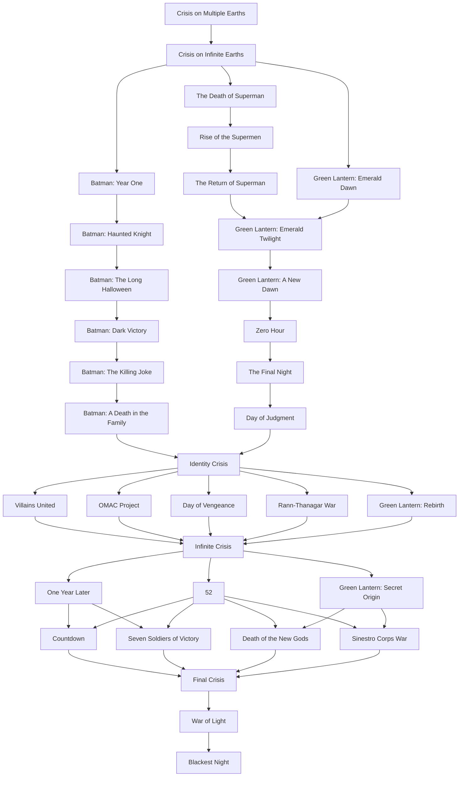

# DC Reading Order with GitLab CI/CD

This project uses GitLab CI/CD as a visual tracker for reading DC comic arcs.

Each arc is represented by a pipeline job, and reading-order arrows are modeled with `needs`.

## Core idea

- By default, **all jobs fail**.
- A job only passes if its `READ_*` variable is set to `1`.
- Jobs also depend on previous arcs, so you cannot progress without completing prerequisites.

## How to mark arcs as read

1. Go to **GitLab > Build > Pipelines > Run pipeline**.
2. In Variables, add `READ_...=1` for each arc you already read.
3. Run the pipeline.
4. Only jobs enabled by both variables and dependencies will pass.

## Quick example

If you already read the first two arcs:

- `READ_CRISIS_ON_MULTIPLE_EARTHS=1`
- `READ_CRISIS_ON_INFINITE_EARTHS=1`

When you run the pipeline:

- `crisis_on_multiple_earths` passes.
- `crisis_on_infinite_earths` passes.
- Next jobs fail (or stay blocked) until you add their variables.

## Recommended workflow

1. Start with a pipeline run without variables to see the full pending/failing state.
2. Every time you finish an arc, add its `READ_*` variable in the next run.
3. Repeat until you complete the full path.

## Reading variables

These are the variables used by the pipeline. Set each one to `=1` to approve an arc:

- `READ_CRISIS_ON_MULTIPLE_EARTHS`
- `READ_CRISIS_ON_INFINITE_EARTHS`
- `READ_BATMAN_YEAR_ONE`
- `READ_THE_DEATH_OF_SUPERMAN`
- `READ_GREEN_LANTERN_EMERALD_DAWN`
- `READ_BATMAN_HAUNTED_KNIGHT`
- `READ_RISE_OF_THE_SUPERMEN`
- `READ_BATMAN_THE_LONG_HALLOWEEN`
- `READ_THE_RETURN_OF_SUPERMAN`
- `READ_BATMAN_DARK_VICTORY`
- `READ_GREEN_LANTERN_EMERALD_TWILIGHT`
- `READ_BATMAN_THE_KILLING_JOKE`
- `READ_GREEN_LANTERN_A_NEW_DAWN`
- `READ_BATMAN_A_DEATH_IN_THE_FAMILY`
- `READ_ZERO_HOUR`
- `READ_THE_FINAL_NIGHT`
- `READ_DAY_OF_JUDGMENT`
- `READ_IDENTITY_CRISIS`
- `READ_VILLAINS_UNITED`
- `READ_OMAC_PROJECT`
- `READ_DAY_OF_VENGEANCE`
- `READ_RANN_THANAGAR_WAR`
- `READ_GREEN_LANTERN_REBIRTH`
- `READ_INFINITE_CRISIS`
- `READ_ONE_YEAR_LATER`
- `READ_52`
- `READ_GREEN_LANTERN_SECRET_ORIGIN`
- `READ_COUNTDOWN`
- `READ_SEVEN_SOLDIERS_OF_VICTORY`
- `READ_DEATH_OF_THE_NEW_GODS`
- `READ_SINESTRO_CORPS_WAR`
- `READ_FINAL_CRISIS`
- `READ_WAR_OF_LIGHT`
- `READ_BLACKEST_NIGHT`

## Note

The pipeline follows the attached diagram flow, including key branching and convergence points toward:

- `Identity Crisis`
- `Infinite Crisis`
- `Final Crisis`
- `War of Light`
- `Blackest Night`

## Mermaid graph

